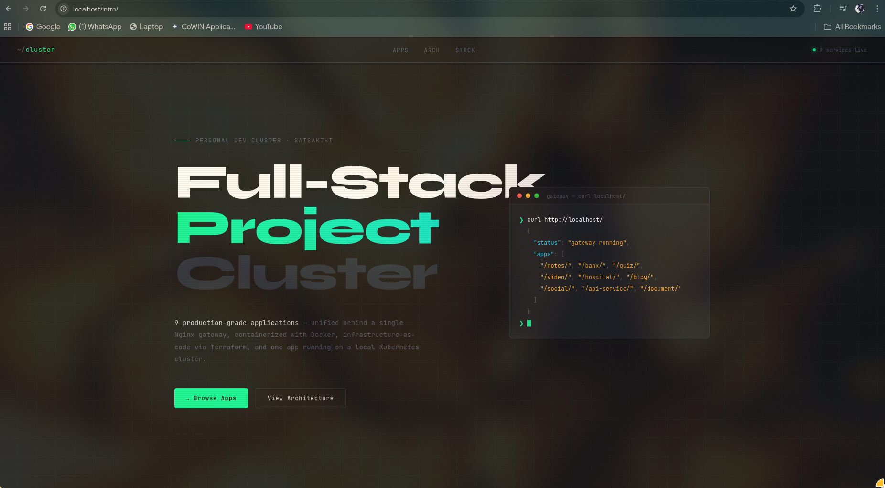
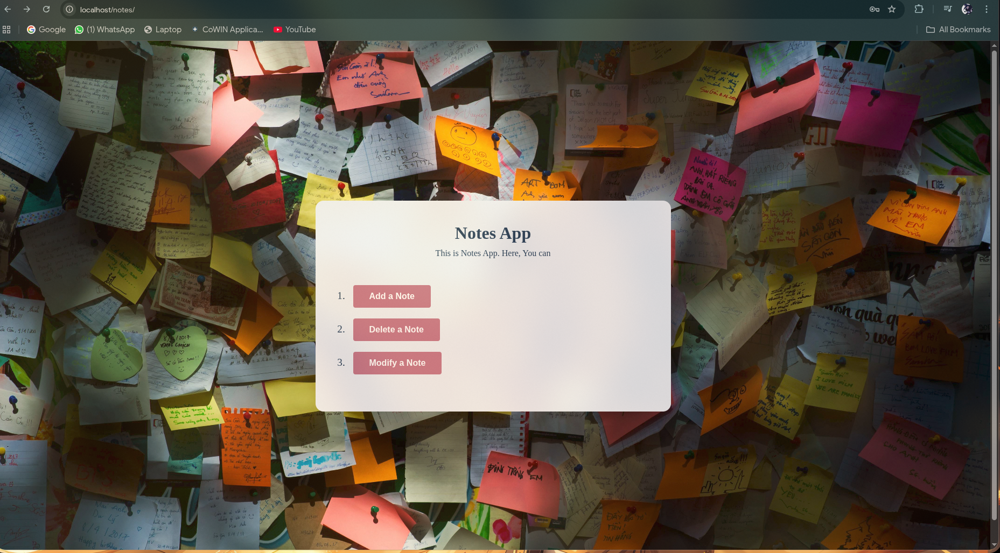
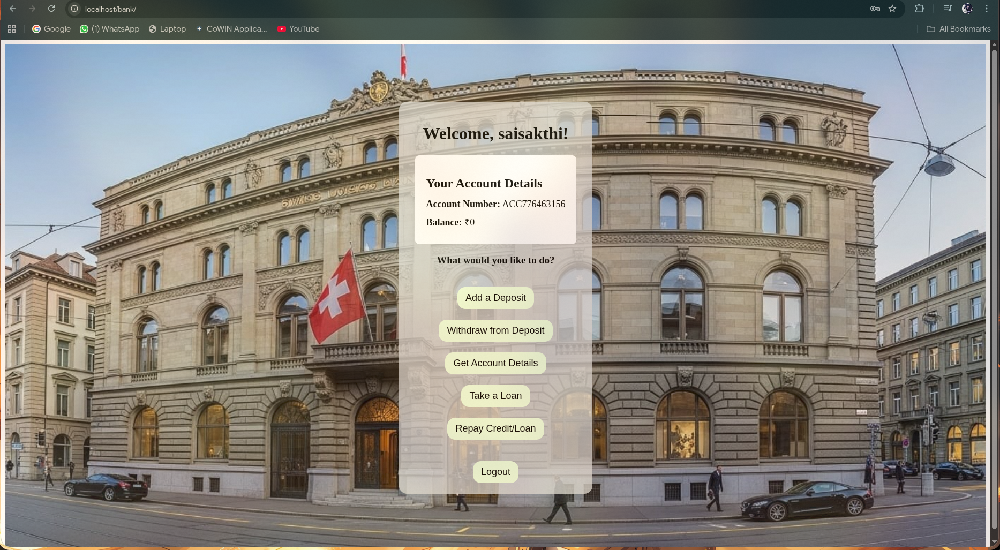
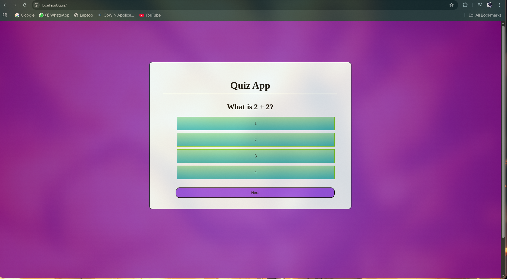
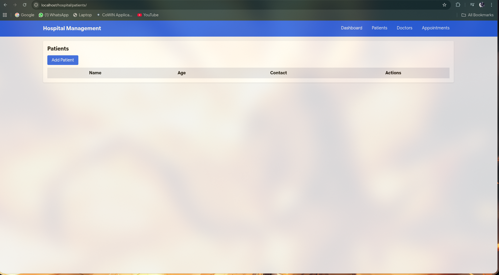
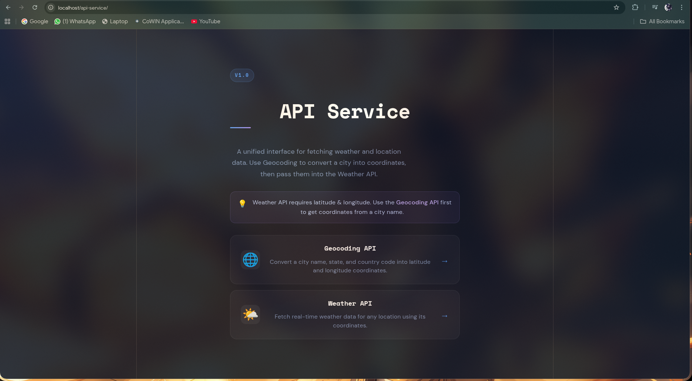
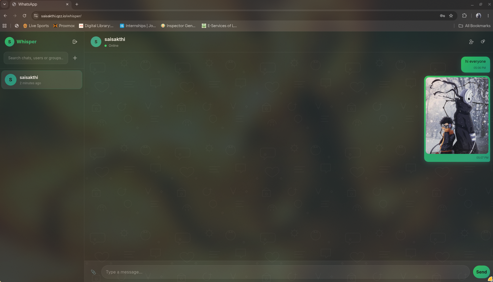
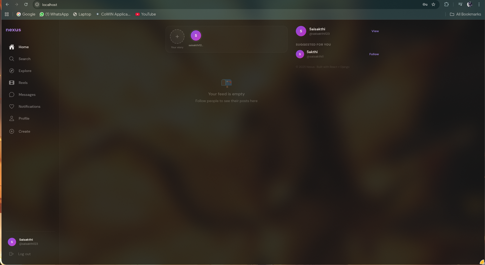

<div align="center">

# ⬡ Infrastructure-Project

**This is a collection of all of my 10 projects all packaged into a infrastructure**


[](https://github.com/SaisakthiM/Infrastructure-Project/releases/latest)
[](LICENSE)
[](infra-cli/)
[](environments/)
[](gitops/)

</div>

---

## Table of Contents

- [Architecture and Stack](#-architecture)
- [Applications](#-applications)
- [Infrastructure Layout](#-infrastructure-layout)
- [CLI Tool](#-cli-tool--social-platform)
- [Getting Started](#-getting-started)
- [Routing Map](#-routing-map)
- [Project Structure](#-project-structure)
- [FAQ](#-faq)
- [Lessons Learned](#-lessons-learned)


## 🏗 Architecture and Stack

```
                        ┌──────────────────────────────────────┐
                        │       Nginx Gateway  :80 / :443       │
                        │   Let's Encrypt SSL — Single Entry     │
                        └──────────────────┬───────────────────┘
                                           │
       ┌───────────────────────────────────┼───────────────────────────────┐
       │                                   │                               │
 ┌─────▼──────┐                    ┌───────▼──────┐               ┌───────▼──────┐
 │  /notes/   │                    │   /bank/     │               │   /quiz/      │
 │  Django    │                    │ Spring Boot  │               │ React static  │
 │ PostgreSQL │                    │ PostgreSQL   │               └──────────────┘
 └────────────┘                    └──────────────┘
 ┌────────────┐                    ┌──────────────┐               ┌──────────────┐
 │  /video/   │                    │  /hospital/  │               │   /blog/     │
 │  Node.js   │                    │   Django     │               │   Django     │
 └────────────┘                    │   SQLite     │               │ MySQL+MinIO  │
                                   └──────────────┘               └──────────────┘
 ┌────────────┐                    ┌──────────────┐               ┌──────────────┐
 │/api-service│                    │  /document/  │               │  /whisper/   │
 │  Node.js   │                    │   Django     │               │  Rust+Axum   │
 │  Express   │                    │ MySQL+MinIO  │               │  PG+MinIO    │
 └────────────┘                    │ Gemini+Ollama│               │  WebSocket   │
                                   └──────────────┘               └──────────────┘

                          /social/ — kind cluster (ArgoCD-managed)
          ┌──────────────────────────────────────────────────────────┐
          │  Django · Go MS · Java MS (Kafka+Cassandra) · React       │
          │  PostgreSQL · Redis · Kafka · Cassandra · MinIO           │
          │  ingress-nginx · kube-prometheus-stack (Helm via ArgoCD)  │
          └──────────────────────────────────────────────────────────┘

                    Observability — kind cluster, ArgoCD-managed
          ┌──────────────────────────────────────────────────────────┐
          │  Prometheus · Grafana · Loki · Tempo · Promtail           │
          │  Jaeger · OpenTelemetry Collector                         │
          └──────────────────────────────────────────────────────────┘

                       Platform tooling — gateway-net
          ┌──────────────────────────────────────────────────────────┐
          │     Jenkins (CI/CD)  ·  Atlantis (PR apply)  ·  n8n      │
          └──────────────────────────────────────────────────────────┘
```

All Docker containers share the `gateway-net` bridge network. The Social Media App and observability stack run inside a `kind` Kubernetes cluster, reconciled by ArgoCD. The gateway container is connected to both networks via the `prod-manage` environment, so `/social/` and `/grafana/` traffic proxies seamlessly into the cluster.



---

## 📦 Applications

### 1 — Notes App
| | |
|---|---|
| **URL** | `/notes/` |



In this app, You can create , modify and delete your notes in this. I wanted a app which has simple functions not like  paint draw etc etc so I made this

---

### 2 — Bank Manager
| | |
|---|---|
| **URL** | `/bank/` |



Here you can create Bank account and simulate how a real world bank works, simply there are 4 functions 
Withdraw, Deposit, Loan, Repay 
and for loan and repay there is a custom credit system and default score is 700

---

### 3 — Quiz App
| | |
|---|---|
| **URL** | `/quiz/` |



I wanted to take a quiz test for a long time, that time I was learning react, there is no backend 
this is pure frontend Quiz app 

---

### 4 — Video Uploader
| | |
|---|---|
| **URL** | `/video/` |


Here you can upload videos and files and download 
a simple cloud storage

---

### 5 — Blog Website
| | |
|---|---|
| **URL** | `/blog/` |


Here you can add blogs and post about yourself. There is login features too with JWT 

---

### 6 — Hospital Management
| | |
|---|---|
| **URL** | `/hospital/` |



In this, You can add a patient and doctors, this is a management system 
and for appointment, you need to have both a doctor and patient

---

### 7 — API Service
| | |
|---|---|
| **URL** | `/api-service/` |



Fetches weather from open-meteo, just a wrapper to it but useful instead of calling it in curl 

---

### 8 — Document Intelligence Platform
| | |
|---|---|
| **URL** | `/document/` |


You can upload documents in this and ask questions, it uses both gemini as primary and phi3 ollama model as fallback

---

### 9 — Whisper (Real-time Chat)
| | |
|---|---|
| **URL** | `/whisper/` |



It is a whatsapp clone with minimal functionalities
here the concept is you have a room and members, 
you can create a room and chat with others by adding 

---

### 10 — Social Media App
| | |
|---|---|
| **URL** | `/social/` |



My most ambitious one yet
I wanted to replicate how microservices work so I did this 
simply, you can login and register (handled by JWT)
then you can post, also add status (like in whatsapp)
it looks simple but took the most time for me 


## ⚙ Infrastructure Layout

### Five Environments

```
environments/
  terragrunt.hcl         # root — generates a local backend per environment
  prod-gateway/          # gateway-net network + Nginx, zero dependencies
  prod-social/           # kind cluster, ArgoCD install, social-media images/Secrets
  prod-docker/           # every non-k8s app (notes, bank, quiz, video, whisper, …)
  prod-infra/            # otel-gateway, node-exporter, n8n, Jenkins, observability app-of-apps
  prod-manage/           # one glue resource: connects gateway container to the kind network
```

### Apply Order

`prod-gateway` and `prod-social` have no dependencies and apply in parallel. Everything else waits on one or both:

```
prod-gateway ─┬─→ prod-docker
              ├─→ prod-infra ←─ prod-social
              └─→ prod-manage ←─ prod-social
```

Terragrunt reads each environment's `dependencies` block and enforces this order automatically:

```bash
cd environments/
terragrunt run --all apply
```


---

## 💻 CLI Tool — `social-platform`

This is a GO CLI tool which makes deploying easier, it can install, configure and deploy it but not all, you will also have to do some work when needed

### Install

```bash
# Linux amd64
curl -Lo social-platform \
  https://github.com/SaisakthiM/Infrastructure-Project/releases/latest/download/social-platform-linux-amd64
chmod +x social-platform && sudo mv social-platform /usr/local/bin/

# Web UI (browser dashboard)
curl -Lo social-platform-webui \
  https://github.com/SaisakthiM/Infrastructure-Project/releases/latest/download/social-platform-webui-linux-amd64
chmod +x social-platform-webui
```

### Commands

```bash
social-platform install                          # check prerequisites + download infra
social-platform configure                        # prompt for secrets → write terraform.tfvars
social-platform deploy                           # terragrunt run --all apply
social-platform deploy --env prod-docker         # deploy a single environment
social-platform deploy --env prod-docker \
  --target docker_container.blog_db              # target a specific resource
social-platform destroy --env prod-docker        # destroy a single environment
social-platform status --env prod-docker         # terragrunt plan (show pending changes)
social-platform import-state                     # auto-detect + import Docker resources into state
social-platform ui                               # launch interactive Bubble Tea TUI
social-platform-webui                            # launch browser dashboard (http://localhost:8080)
```

### Web UI

```bash
social-platform-webui           # http://localhost:8080
social-platform-webui --port 9090
```

Provides a dark-theme browser dashboard with live SSE-streamed command output, environment selector, and a Docker state import panel.

---

## 🚀 Getting Started

### Prerequisites

| Tool | Version | Install |
|------|---------|---------|
| Docker | latest | https://docs.docker.com/desktop/ |
| Terraform | ≥ 1.6 | https://developer.hashicorp.com/terraform/install |
| Terragrunt | ≥ 0.59 | https://terragrunt.gruntwork.io/docs/getting-started/install/ |
| `kind` | ≥ 0.20 | https://kind.sigs.k8s.io/docs/user/quick-start/ |
| `kubectl` | latest | https://kubernetes.io/docs/tasks/tools/ |
| ArgoCD CLI | latest | https://argo-cd.readthedocs.io/en/stable/cli_installation/ |

### Option A — Using the CLI (recommended)

```bash
# Install the CLI
curl -Lo social-platform \
  https://github.com/SaisakthiM/Infrastructure-Project/releases/latest/download/social-platform-linux-amd64
chmod +x social-platform && sudo mv social-platform /usr/local/bin/

# Install prerequisites + download infra
social-platform install

# Configure secrets (stores in OS keychain, writes terraform.tfvars)
social-platform configure

# Deploy everything
social-platform deploy
```

### Option B — Manual

```bash
git clone https://github.com/SaisakthiM/Infrastructure-Project.git
cd Infrastructure-Project/environments

# Before first apply — update gitops_repo_url in:
#   environments/prod-social/terraform.tfvars
#   environments/prod-infra/terraform.tfvars
#   gitops/social-media/apps/social-workload-app.yaml
#   gitops/observability/apps/*.yaml
# Replace git@github.com:SaisakthiM/Coding-Project.git with your actual repo URL.

terragrunt run --all apply
```

All apps will be live at `http://localhost/<app>/` once provisioned.

### Tear Down

```bash
social-platform destroy        # all environments
# or
cd environments && terragrunt run --all destroy
```

---

## 🗺 Routing Map

| URL | App | Backend |
|-----|-----|---------|
| `/intro/` | Intro Page | Static |
| `/notes/` | Notes App | `notes-backend:8000` |
| `/bank/` | Bank Manager | `bank-backend:8080` |
| `/quiz/` | Quiz App | Static |
| `/video/` | Video Uploader | `video-uploader-backend:8080` |
| `/hospital/` | Hospital Management | `hospital-management:8000` |
| `/blog/` | Blog Website | `blog-website:8000` |
| `/api-service/` | API Service | `api-service-backend:8000` |
| `/document/` | Document Platform | `doc-backend:8000` |
| `/whisper/` | Whisper Chat | `whisper_backend:8000` |
| `/whisper/ws/` | Whisper WebSocket | `whisper_backend:8000 → /ws/` |
| `/social/` | Social Media App | `kind` → ingress-nginx NodePort |
| `/grafana/` | Grafana dashboards | `kind` → Grafana pod |
| `/jaeger/` | Distributed tracing | `kind` → Jaeger pod |
| `/otel/` | OTLP ingest | `kind` → OTel Collector |
| `/argocd/` | ArgoCD UI | `kind` → ArgoCD server |
| `/jenkins/` | Jenkins CI/CD | `jenkins:8080` |
| `/n8n/` | n8n automation | `n8n:5678` |

### Health Check

```bash
curl http://localhost/
# {"status":"gateway running","apps":["/notes/","/bank/","/quiz/","/video/",...]}
(When you run locally use these links)
```


## ❓ FAQ

**Q: Why Terraform instead of Docker Compose?**

As the project scaled from 2 apps to 9, Docker Compose became impossible to maintain — databases, frontends, backends, networks, and volumes all in one monolithic file. Terraform gives each concern its own resource with explicit dependencies, state tracking, and lifecycle management. When something breaks, you know exactly what changed.

**Q: Why ArgoCD for Kubernetes instead of `helm install` or `kubectl apply`?**

Self-healing. If a pod crashes or a manifest drifts, ArgoCD reconciles it back automatically. With Compose or manual kubectl, I'd have to notice the failure, rebuild, and reapply manually. The tradeoff: no automated tests on changes yet, so breaking changes require a rollback. Worth it for the operational simplicity.

**Q: Why a separate database instance per app instead of one shared Postgres?**

Isolation over storage efficiency. If a shared Postgres goes down, every app goes down with it. With separate instances, a failure in the Blog's MySQL doesn't affect Notes or Bank. The extra disk usage is the explicit tradeoff for fault isolation.

**Q: Why Kubernetes (`kind`) for the Social Media App?**

The social media app is genuinely microservices — Django backend, Go microservice, Java microservice (Cassandra + Kafka), React frontend, all with different scaling and failure characteristics. Kubernetes gives self-healing, rolling updates, service discovery, and resource limits that Docker Compose can't match at that complexity level.

**Q: Why Kafka?**

The Java microservice uses it for the notification subsystem — an event-driven pattern where producers publish user events and consumers fan them out to recipients. Overkill for the scale, but the goal was to build something architecturally realistic, not minimal.

**Q: How is this exposed publicly?**

Via Cloudflare Tunnel. No ports opened on the router — the tunnel binary runs as a container, connects outbound to Cloudflare's edge, and traffic arrives at `saisakthi.qzz.io`. Free subdomain from `qzz.io` via DigitalPlat, NS delegated to Cloudflare.

---

## 📖 Lessons Learned

**Persistence beats cleverness.** There will be 12-hour sessions staring at a URL mismatch in the proxy config or a certificate error that turns out to be one wrong character in `nginx.conf`. The only way through is not around.

**Integration errors are different from code errors.** Individual projects worked fine in isolation. The moment they got wired together behind a reverse proxy, error cascades appeared that no amount of unit testing would have caught. The lesson: think in systems from day one, not just in code.

**Documentation is painful to write and essential to have.** Future-me staring at a 3,000-line `main.tf` with no comments is exactly why this README exists. Sorry, future me.

**The world doesn't stop for your project.** Terraform provider breaking changes, Terragrunt CLI restructuring, ArgoCD API updates, Docker socket permission models — every dependency updates on its own schedule. Being error-tolerant isn't a personality trait, it's a required skill.

**Infrastructure is the hardest part to test.** `terraform plan` lies sometimes. ArgoCD shows healthy when the app is actually broken. The only real test is applying to a real environment and watching what happens.


<div align="center">

Built by **Saisakthi M** &nbsp;·&nbsp; Chennai, India &nbsp;·&nbsp;

</div>
